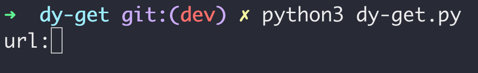
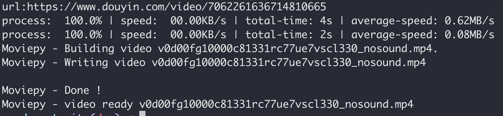
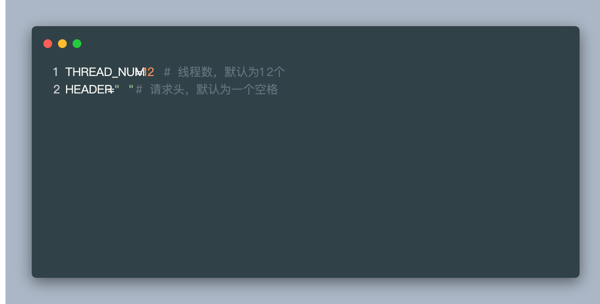

<center><h1>
  dy-get
  </h1></center>

### **<u>严禁使用本工具做违法事情</u>**

#  dy-get 使用方法:

```bash
python3 dy-get.py
```



在出现此文本后，输入抖音视频链接(https://douyin.com)

注意!链接必须是以下格式:

- https://www.douyin.com/video/7062261636714810665      注意:7062261636714810665可以是任意数字
- https://www.douyin.com/share/video/7062261636714810665

输入完成后按回车键继续



正常应该会出现以上界面

完成后会在当前目录下创建 [vid]_[unixtime]视频目录，在视频目录下会有video和music目录，分别是视频目录与音频目录


# dy-get 自定义

dy-get是完全支持自定义的



THREAD_NUM 线程数，默认为12线程

HEADER 请求头，默认为空格，如果没有，必须要一个空格

